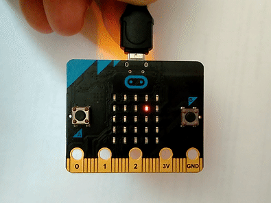

# Juego de habilidad

Basándome en una simple idea surgida cuando estaba descubriendo las posibilidades de la placa Micro:bit. Se me ocurrió poder implementar sobre ella un pequeño juego que fuese atractivo y motivador para los chavales, sería utilizado para dar un paso de gigante en el desarrollo de sus habilidades en programación, la introducción de los beneficios de trabajar con procedimientos y funciones. 

Así surge esta idea. Es un juego en el que utilizando los acelerómetros que posee esta placa, los chavales pueden probar sus habilidades. El juego es solo una excusa, ya que lo que estamos en el fondo persiguiendo es desarrollar sus hablidades en programación. Aparte de las disciplinas básicas, hay algún problema matemático que se ha resuelto en la implementación del programa que será utilizado como ejercicio de profundización.


## Materiales

- 1 Raspberry Pi
- 1 Cable USB - microUSB
- 1 Micro:bit

## Esquema eléctrico

Descripción y fórmulas del esquema eléctrico si las hubiese

```
V = 5V - 2.1V = 2.9V
I = 20mA

Fórmulas
```


## Programación

Empecemos con el primer juego, una pelotita que hay que mantener en la fila central sin que se salga por los laterales utilizando el acelerómetro del eje x para que se mantenga en las posiciones centrales.

```python
# Programa en python
from microbit import *
posicion=('50000','05000',"00500","00050","00005") # Array con las distintas posiciones en las que puede estar la pelotita.

bola_x=2 # Posición donde comienza la pelotita
while True:
    reading = accelerometer.get_x()
    
    if reading > 20:
        if bola_x ==4:
            display.show(Image.SAD) # Nos hemos salido del tablero de juego por la derecha
            sleep(1000)
            bola_x = 4
        else:
            bola_x += 1
            display.show(Image("00000:00000:"+posicion[bola_x] + ":00000:00000"))
            sleep(500)
            
    if reading < -20:
        if bola_x ==0:
            display.show(Image.SAD) # Nos hemos salido del tablero de juego por la izquierda
            sleep(1000)
            bola_x=0
        else:
            bola_x -= 1
            display.show(Image("00000:00000:"+posicion[bola_x] + ":00000:00000"))
            sleep(500)
```
El juego quedaría así:


El siguiente paso parece evidente, extenderlo a todos los leds y trabajar en dos dimensiones, aquí surgen al gunos pequeños problemas que hay que resolver pero con un poco de esfuerzo nada es imposible.

```
# Programa en python
from microbit import *
posicion=('50000','05000',"00500","00050","00005")

# Posiciones iniciales de la pelotita
bola_x=2
bola_y=2

sensibilidad = 20 # Disminuir el número para aumentar la sensibilidad
dificultad = 200 # Poner un número más pequeño para aumentar la dificultad del juego


while True:
    read_x = accelerometer.get_x()
    read_y = accelerometer.get_y()
    if read_y > sensibilidad:
        if bola_y == 4:
            display.show(Image.SAD)
            sleep(1000)
            bola_y = 4
        else:
            bola_y += 1
            cadena=''
            for i in range(5):
                if i != bola_y:
                    cadena += '00000:'
                else:
                    cadena = cadena + posicion[bola_x] + ':'
            cadena = cadena[:29]
            display.show(Image(cadena))
            sleep(dificultad)

    if read_y < -1 * sensibilidad:
        if bola_y == 0:
            display.show(Image.SAD)
            sleep(1000)
            bola_y = 0
        else:
            bola_y -= 1
            cadena=''
            for i in range(5):
                if i != bola_y:
                    cadena += '00000:'
                else:
                    cadena = cadena + posicion[bola_x] + ':'
            cadena = cadena[:29]
            display.show(Image(cadena))
            sleep(dificultad)


    if read_x > sensibilidad:
        if bola_x ==4:
            display.show(Image.SAD)
            sleep(1000)
            bola_x = 4
        else:
            bola_x += 1
            cadena=''
            for i in range(5):
                if i != bola_y:
                    cadena += '00000:'
                else:
                    cadena = cadena + posicion[bola_x] + ':'
            cadena = cadena[:29]
            display.show(Image(cadena))
            sleep(dificultad)
    if read_x < -1*sensibilidad:
        if bola_x ==0:
            display.show(Image.SAD)
            sleep(1000)
            bola_x=0
        else:
            bola_x -= 1
            cadena=''
            for i in range(5):
                if i != bola_y:
                    cadena += '00000:'
                else:
                    cadena = cadena + posicion[bola_x] + ':'
            cadena = cadena[:29]
            display.show(Image(cadena))
            sleep(dificultad)

```


