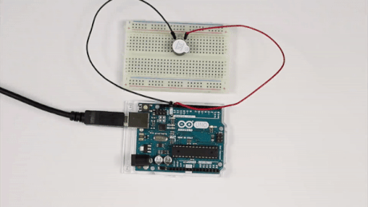

# La Guerra de las Galaxias

El objetivo de esta práctica consiste en reproducir con ayuda de un zumbador la banda sonora de La Guerra de las Galaxias mediante frecuencias.



## Materiales

- 1 Arduino UNO
- 1 Protoboard
- 2 Latiguillos
- 1 Zumbador

## Esquema eléctrico

| Zumbador piezo-eléctrico         |       |
| -------------------------------- | ----- |
| Polarizado                       | Sí    |
| Tensión de trabajo               | 3-12V |

Se conecta el cable negro (negativo) del zumbador al pin GND de la placa de arduino y el cable rojo (positivo) al pin analógico PWM 9 de la placa de arduino.


## Programación en mBlock

Al ejecutar el código utilizamos los bloques de sonido siguiendo la partitura de la banda sonora de La Guerra de las Galaxias.


## Programación en Arduino

En primer lugar se crea una lista con las notas y tonos de cada una de las notas. También se va a utilizar una función encargada deemitir una frecuencia pasada por parámetro durante una determinada duración, también pasada por parámetro.

Por otro lado, al ejecutar el código se llama a la función que reproduce la nota dada siguiendo la partitura de la banda sonora de La Guerra de las Galaxias.

```arduino
/**
 * La Guerra de las Galaxias
 */

int c[5]={131,262,523,1046,2093}; // Do
int d[5]={147,294,587,1175,2349}; // Re
int e[5]={165,330,659,1319,2637}; // Mi
int f[5]={175,349,698,1397,2794}; // Fa
int g[5]={196,392,784,1568,3136}; // Sol
int a[5]={220,440,880,1760,3520}; // La
int b[5]={247,494,988,1976,3951}; // Si

void nota(int frecuencia, int duracion){
    tone(9, frecuencia);
    delay(duracion);
    noTone(9);
    delay(50);
}

void setup() {

}

void loop() {
    nota(f[2],500);
    nota(f[2],500);
    nota(f[2],500);
    nota(d[2],250);
    nota(a[2],250);
    nota(f[2],500);
    nota(d[2],250);
    nota(a[2],250);
    nota(f[2],500);
    delay(500);
    nota(c[3],500);
    nota(c[3],500);
    nota(c[3],500);
    nota(d[3],250);
    nota(a[2],250);
    nota(f[2],500);
    nota(d[2],250);
    nota(a[2],250);
    nota(f[2],500);
    delay(1000);
}
```
