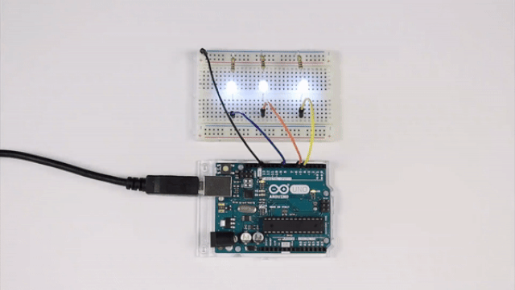
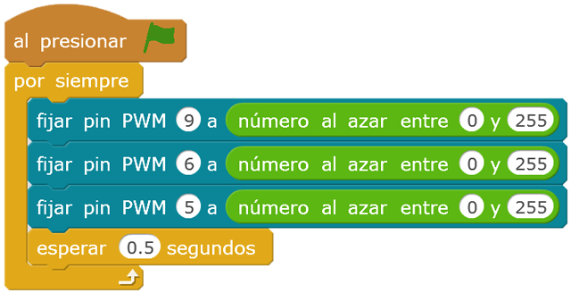

# Luces aleatorias

El objetivo de esta práctica es encender en diferentes intensidades 3 LEDs blancos, es decir, se va a programar un código encargado de encender cada LED blanco a una intensidad de luz diferente (haciendo uso de la salida analógica).



## Materiales

- 1 Arduino UNO
- 1 Protoboard
- 4 Latiguillos
- 3 LEDs blancos
- 3 Resistencias de 100Ω (marrón-negro-marrón)

## Esquema eléctrico

| Características LED              |        |
| -------------------------------- | ------ |
| Polarizado                       | Sí     |
| Intensidad de Corriente          | 20mA   |
| Tensión Led (verde, ámbar, rojo) | 2.1V   |
| Tensión Led blanco               | 3.3V   |

**Cálculo de la resistencia para el LED**

<pre>
V = 5V - 2.1V = 2.9V
I = 20mA

V = I x R ; R = V / I

R = 2.9V / 0.02A = 145Ω -> 220Ω (por aproximación)
</pre>

Se conectan los LEDs a los pines analógicos PWM (~) 9, 6 y 5. La patilla larga del LED debe ser conectada al voltaje positivo (ánodo) y la corta al voltaje negativo (cátodo) pasando por la resistencia.


## Programación en mBlock

Al ejecutar el código se establecerá un valor aleatorio entre 0 y 255 en cada uno de los pines analógicos PWM. Además esperaremos medio segundo para poder visualizar el efecto.



## Programación en Arduino

En primer lugar, se configura los pines analógicos PWM 9, 6 y 5 en modo salida (OUTPUT). Esta configuración se establece en la función setup(), ya que solamente se ejecuta una vez.

Por otro lado, al ejecutar el código se establecerá un valor aleatorio entre 0 y 255 en cada uno de los pines analógicos PWM y esperaremos medio segundo (500 milisegundos) para visualizar el efecto aleatorio.

```
/**
 * Luces aleatorias
 */

void setup() {
    pinMode(9, OUTPUT);
    pinMode(6, OUTPUT);
    pinMode(5, OUTPUT);
}

void loop() {
    analogWrite(9, random(0, 255));
    analogWrite(6, random(0, 255));
    analogWrite(5, random(0, 255));
    delay(500);
}
```
