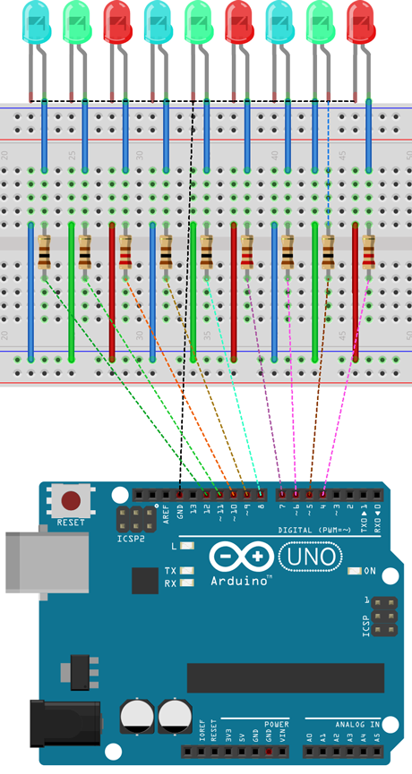

# Luces de feria

En esta práctica se hacen varios efectos de encendido de nueve LEDs. Utilizando pines digitales de la placa de Arduino.


## Materiales

- 1 Placa de Arduino UNO
- 1 Protoboard
- Latiguillos
- 9 Diodos LED
- 9 Resistencias

## Esquema eléctrico

Cuando conectamos un componente electrónico a una placa de Arduino, se ejerce sobre él una diferencia de potencial de 5V en ámbos extremos, es decir, si conectamos el Led a una placa de Arduino, estará recibiendo una tensión de 5V, que es la tensión operativa que ejerce Arduino en sus pines.



## Programación en Arduino


```
/**
 * Luces de feria
 */

int pinArray[] = {4,5,6,7,8,9,10,11,12};
int count = 1;
int espera = 100;

void setup(){
    for (count=1; count<9; count++){
        pinMode(pinArray[count], OUTPUT);
    }
}

void loop(){
    for (count=1;count<9;count++) { 
        digitalWrite(pinArray[count], HIGH); 
        delay(espera);
        digitalWrite(pinArray[count], LOW);
        delay(espera);
    }
    for (count=9;count>=1;count--) {
        digitalWrite(pinArray[count], HIGH); 
        delay(espera);
        digitalWrite(pinArray[count], LOW);
        delay(espera);
    }
    for (count=1;count<9;count++) {
        digitalWrite(pinArray[count], HIGH);
        delay(espera);
        digitalWrite(pinArray[count + 1], HIGH);
        delay(espera);
        digitalWrite(pinArray[count], LOW);
        delay(espera*2);
    }
    for (count=9;count>1;count--) {
        digitalWrite(pinArray[count], HIGH);
        delay(espera);
        digitalWrite(pinArray[count - 1], HIGH);
        delay(espera);
        digitalWrite(pinArray[count], LOW);
        delay(espera*2);
    }
    for (count=1;count<4;count++) {
        digitalWrite(pinArray[count], HIGH); 
        digitalWrite(pinArray[count+3], HIGH); 
        digitalWrite(pinArray[count+6], HIGH); 
        delay(300);
        digitalWrite(pinArray[count], LOW);
        digitalWrite(pinArray[count+3], LOW);
        digitalWrite(pinArray[count+6], LOW);
        delay(300);
    }
}
```
