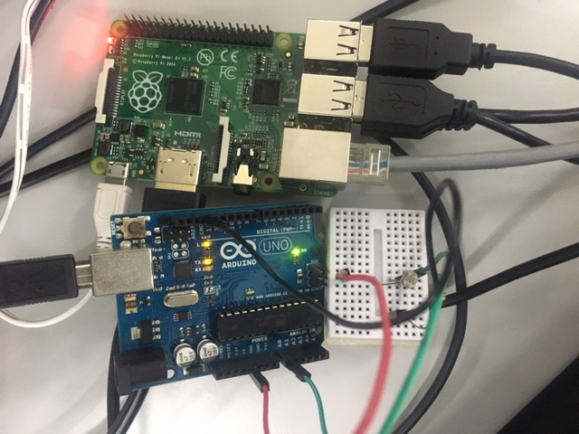
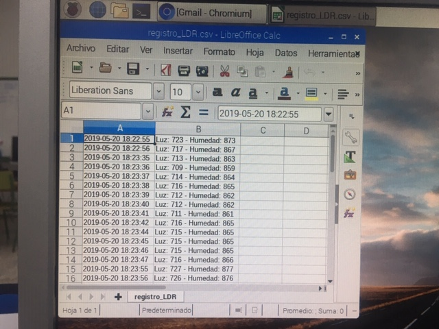

# Registro de Nivel de iluminación LDR y Humedad en Archivo CSV

Envio de datos de sensor LDR y humedad conectados a las entradas analógicas de Arduino y enviados a la Raspberry a traves de Pyserial y guardado en un archivo csv





## Materiales

- 1 Raspberry Pi
- 1 Arduino
- 1 Cable

## Esquema eléctrico

Descripción y fórmulas del esquema eléctrico si las hubiese

```
V = 5V - 2.1V = 2.9V
I = 20mA

Fórmulas
```

## Programación

Descripción interesante sobre la programación

```python
# Programa en python
rom time import sleep, strftime, time
import serial, time

arduino = serial.Serial('/dev/ttyACM0', 9600)

while True:
  cadena = arduino.readline()
  
  if(cadena.decode() != ''):
    cadena = str(cadena.decode())
    cadena = cadena.split(',')
    luz = int(cadena[0])
    humedad = int(cadena[1])
    
    if luz > 700: # Si hay mucha luz
        imprimir = 'Luz: '+str(luz)+' - Humedad: '+str(humedad)
        print(imprimir)
        with open("/home/pi/Desktop/PROYECTO-PYSERIAL-CSV/pyserial_csv/registro_LDR.csv", "a") as log:#"a" es registro continuo
            log.write("{0},{1}\n".format(strftime("%Y-%m-%d %H:%M:%S"),str(imprimir)))
  
  time.sleep(1)

arduino.close()
```

```arduino
// Programa en arduino
void setup () {
  Serial.begin(9600);
}

void loop () {
  int luz = analogRead(0);
  int humedad = analogRead(0) + 150;
  
  String cadena = String(luz) + ',' + String(humedad);
  Serial.println(cadena);
  delay(1000);
}
```
