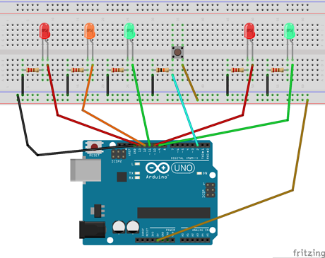
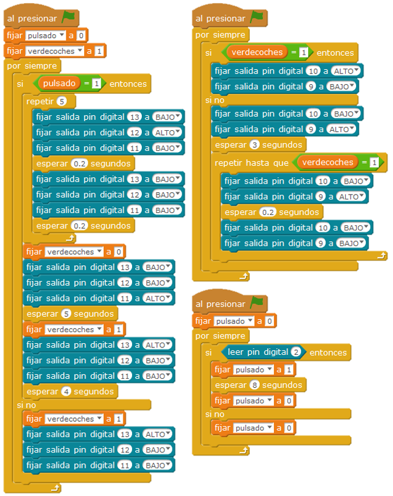

# Semáforo con pulsador

El proyecto consiste en un cruce de semáforos, uno de vehículos y otro de peatones. El semáforo de vehículos está normalmente verde (y el de peatones rojo), hasta que algún peatón pulsa el pulsador. Entonces, el naranja de los vehículos parpadea durante un tiempo prudencial y pasa a rojo. En ese momento el semáforo de peatones pasa a verde. Tras unos segundos el verde de los peatones parpadea y pasa a rojo. En ese momento el de los vehículos pasa a verde.

## Materiales

- 1 Placa de Arduino
- 1 Protoboard
- 1 pulsador
- 5 leds (2 verdes, 2 rojos, 1 naranja)
- 6 resistencias (5 de 220Ω, 1 de 10kΩ) 
- cables

## Esquema eléctrico

Se han conectado en paralelo los 5 leds a través de una resistencia cada uno y el pulsador. Los Leds cada uno a una entrada digital del arduino. Además se conecta el circuito al GND y al Vcc del arduino para que tenga corriente.

## Programación en mBlock

Se han creado dos variables para poder evidenciar dos estados 0 o 1, 
-	Variable pulsado: 1 para cuando pulsa el peatón
-	Variable esperaverde: 1 indicando cuando está verde para los peatones y rojo para los coches.

