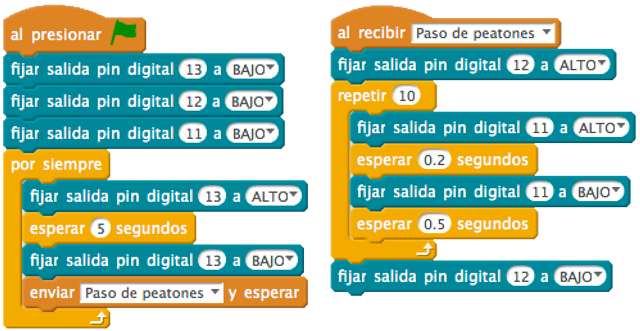

# Semáforo de peatones

El objetivo de esta práctica es construir un semáforo para peatones utilizando dos LEDs y un zumbador, es decir, se va a programar un código encargado de encender una luz roja y una luz verde al mismo tiempo que se emite un zumbido para avisar al peatón que puede cruzar por el paso de peatones.


## Materiales

- 1 Arduino UNO
- 1 Protoboard
- 5 Latiguillos
- 2 LEDs
- 2 Resistencias de 220Ω (rojo-rojo-marrón)
- 1 Zumbador

## Esquema eléctrico

| Características LED              |        |
| -------------------------------- | ------ |
| Polarizado                       | Sí     |
| Intensidad de Corriente          | 20mA   |
| Tensión Led (verde, ámbar, rojo) | 2.1V   |
| Tensión Led blanco               | 3.3V   |

| Características Zumbador         |        |
| -------------------------------- | ------ |
| Polarizado                       | Sí     |
| Tensión de trabajo               | 3-12V  |

**Cálculo de la resistencia para el LED**

```
V = 5V - 2.1V = 2.9V
I = 20mA

V = I x R ; R = V / I

R = 2.9V / 0.02A = 145Ω -> 220Ω (por aproximación)
```

Se conecta el LED rojo al pin digital 13 y el LED de color verde al pin digital 12 de la placa de arduino (utilizando su debida resistencia). La patilla larga del LED debe ser conectada al voltaje positivo (ánodo) y la corta al voltaje negativo (cátodo) pasando por la resistencia. El zumbador se conecta debidamente polarizado al pin digital 11.


## Programación en mBlock

Al ejecutar el código se deberán establecer los pines digitales a valores bajos, lo que se conoce como inicialización. A continuación, en el bucle principal del programa se programa la activación del pin 13 en valor a alto de manera que espere 5 segundos. Una vez transcurrido el tiempo de espera se desactiva el pin 13 y se llama a un evento encargado de hacer la programación del paso de peatones. En este evento puedes observar que se reproducirá el sonido de encendido y apagado 10 veces al estar conectado al pin digital 11.



## Programación en Arduino

En primer lugar, se configuran los pines digitales 11, 12 y 13 en modo salida (OUTPUT). Esta configuración se establece en la función setup(), ya que solamente se ejecuta una vez. Además, se ha creado la inicialización de los pines a un valor bajo (LOW).

Por otro lado, en la función principal loop() se programa la activación del pin 13 en valor a alto de manera que espere 5 segundos (5000 milisegundos). Una vez transcurrido el tiempo de espera se desactiva el pin 13 y se recorre un bucle encargado de hacer la programación del paso de peatones. En el interior del bucle puedes observar que se reproducirá el sonido de encendido y apagado 10 veces al estar conectado al pin digital 11.

```arduino
/**
 * Semáforo de peatones
 */

void setup() {
    pinMode(13, OUTPUT);
    pinMode(12, OUTPUT);
    pinMode(11, OUTPUT);
    digitalWrite(13, LOW);
    digitalWrite(12, LOW);
    digitalWrite(11, LOW);
}

void loop() {
    digitalWrite(13, HIGH);
    delay(5000);
    digitalWrite(13, LOW);
    
    digitalWrite(12, HIGH);
    for(int i=0; i<10; i++){
        digitalWrite(11, HIGH);
        delay(200);
        digitalWrite(11, LOW);
        delay(500);
    }
    digitalWrite(12, LOW);
}
```
