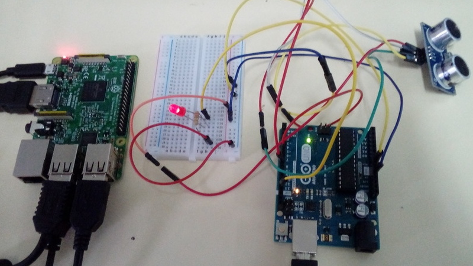

# Datos de Arduino a Raspberry Pi

Paso de los datos del monitor de Arduino a través de Raspberry pi para monitorizarlo desde el ordenador



## Materiales
- Placa protoboard
- Sensor ultrasónico HCSR04
- Led
- Resistencia 220 ohmios
- Arduino
- Cables
- 1 Raspberry Pi
- 1 Cable de conexión Raspberry
- 1 Cable de conexión Arduino
- 1 Adaptador VGA a HDMI

## Esquema eléctrico

Conecta directamente a la placa protoboard el sensor ultrasónico o también se puede conectar como en la foto.

El pin Trig se encarga de emitir el sonido ultrasónico. En esta práctica se conecta en el pin10 de Arduino.

(Los humanos no somos capaces de percibirlo)

El pin Echo recibe el sonido ultrasónico que le ha enviado el Trig. En esta práctica se conecta en el pin12 de Arduino.

El pin Vcc se conecta a 5V.

El pin GND se conecta en GND.

El led  que pondremos adicionalmente se conecta en el pin 13 (no olvides que el negativo del led lleva una resistencia de 220 ohmios y va conectado a otro GND y la patilla positiva al pin 13)

En este programa se ha puesto que en un rango de 15 cm el led se enciende y detecta la distancia que se lee pinchando en la lupa de la esquina derecha arriba en el programa de Arduino.

```
La fórmula que se utiliza para obtener la distancia en el programa es:

Velocidad = Distancia/ Tiempo      

despejando queda:

Distancia= Velocidad x Tiempo

Pero hay que dividir la distancia  entre 2 porque es el doble el recorrido que hace.

La constante de la velocidad del sonido es 1/29.

343 \frac{m}{s} \cdot{} 100 \frac{cm}{m} \cdot{} \frac{1}{1000000} \frac{s}{\mu s} = \frac{1}{29.2} \frac{cm}{\mu s}

En el programa Distancia se llama distance y tiempo se llama duration

Distancia= (Tiempo/2)/29 por lo que queda distance=(duration/2)/29
```

## Programación

```python
# Programa en python
import serial, time

arduino = serial.Serial('/dev/ttyACM0', 9600)

while True:
    cadena = arduino.readline()
  
    if(cadena.decode() != ''):
        print(cadena.decode())
  
    time.sleep(1)

arduino.close()
```

```arduino
int trig = 10;  
int echo = 12;
int led = 13;

void setup() {
    Serial.begin (9600);

    pinMode(trig, OUTPUT); // sale la señal
    pinMode(echo, INPUT); //entra la señal
    pinMode(led,OUTPUT); //sale la señal
}

void loop() {
    long duration; //duración de la onda en llegar
    int distance;  // distancia recorrida de la onda
    
    //inicializamos el Trig desde apagado y esperamos 2 microsegundos
    digitalWrite(trig, LOW);
    delayMicroseconds(2);

    // activamos el Trig durante 10 microsegundos y luego lo apagamos
    digitalWrite(trig, HIGH);
    delayMicroseconds(10);
    digitalWrite(trig, LOW);

    // Echo recibe la señal  y  detectará el tiempo en que ha tardado en llegar la señal
    duration = pulseIn(echo, HIGH);  //en pulseIn  es una i mayúscula

    //la  siguiente fórmula calculará  la distancia recorrida
    distance = (duration/2)/29;  

    // si la distancia está entre 0 y 200 cm estará fuera de rango y no se podrá monitorizar
    if (distance >= 200 || distance <= 0){
        Serial.println("fuera de rango");
    }
    // de lo contrario aparecerá la distancia en cm
    else {
        Serial.print(distance);
        Serial.println(" cm");
    }

    // si la distancia es menor de 15 cm y mayor de 0 cm  el Led se encenderá
    if (distance <=15 && distance >= 0){
        digitalWrite(led,HIGH);
    }
    // de lo contrario el led estará apagado
    else {
        digitalWrite(led,LOW);
    }
    delay(500);
}
```
